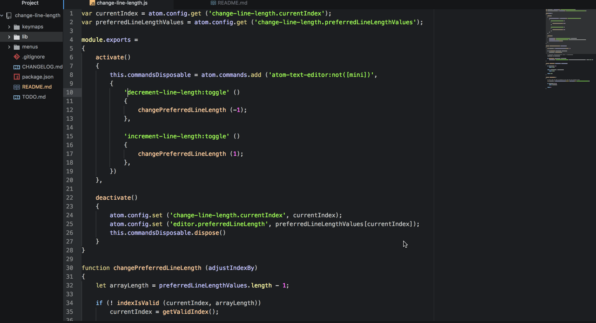

# change-line-length

[](https://atom.io/packages/change-line-length)

An [Atom](https://atom.io) text editor package that lets you cycle through
different user-defined Preferred Line Length settings

## `change-line-length` in Action:

*Focus on the wrap guide.*


## History:

Because I frequently switch my Preferred Line Length between 80 characters (for
documentation) and 100 characters (for code), I often spend too much time
navigating to the editor settings panel, scrolling down, and manually adjusting
this setting.  There exists some packages that allow you to insert multiple wrap
guides, but I've found this solution to be somewhat of a distraction.  Also,
many packages, such as [`autoflow`](https://atom.io/packages/autoflow) and
[`text-align`](https://atom.io/packages/text-align) are dependent upon the
Preferred Line Length setting; having multiple wrap guides can be confusing when
using these packages as only one of the wrap guides will represent the true
Preferred Line Length value being used.  So I decided it would be best to make a
package that allows the user to set as many Preferred Line Length settings as
they want and give them the option to cycle through them quickly, with key
commands.

## Instructions:

Atom doesn't seem to provide a way for the user to input values into an array in
the package settings in the same way one can input integers (correct me if I'm
wrong!), so you must edit the `config.cson` to add your own custom preferred
line length values.  Find the settings section for `change-line-length` in the
`config.cson` file (Atom > Config...) and add your preferred values:

```cson
"change-line-length":
  preferredLineLengthValues: [
    80
    100
    120
    ...
  ]
```

After you've saved you `config.cson` file, you'll need to restart Atom for the
settings to take effect (this is intentional as capturing the array values on
the fly during each run is inefficient).  You should be able to use the package
to quickly change between your Preferred Line Length settings.

## Note:

There seems to be "bugginess" associated with running this package if the
settings tab is open and set to the editor (the location of the Preferred Line
Length setting).  So if you are experiencing any sort of strange flickering when
running the package, try exiting out of the settings tab.  I can't seem to fix
as this seems like a bug with Atom.  I've experienced many bugs when trying to
set settings via the settings tab; these bugs include the setting not actually
being recognized or settings "flickering" between an older and newer value when
trying to update a value.  These bugs existed for me long before creating this
package and I think they are the root cause for the strange flickering that
occurs when this package is ran while the settings tab is open.  If anyone has
any sort of ideas for a fix, please let me know, as stability is always a
priority for me.

## Thank You
Thanks to both @[Aerijo](https://github.com/Aerijo) and
@[DamnedScholar](https://github.com/DamnedScholar) for helping me
[here](https://discuss.atom.io/t/changing-an-atom-setting-through-code/57728)
and
[here](https://discuss.atom.io/t/bugginess-associated-with-changing-atom-settings-via-code/57772)
when I ran into bugs putting this package together.
